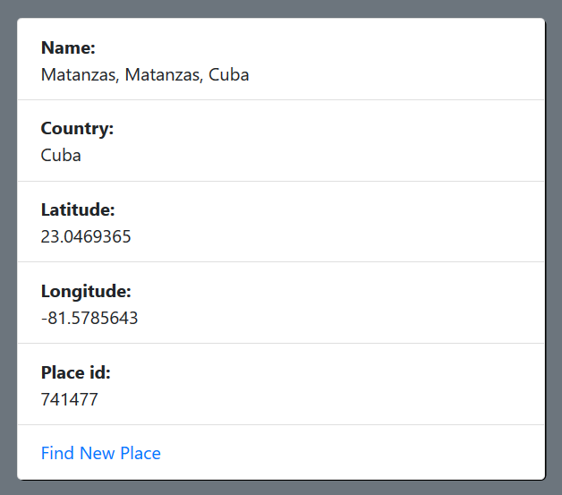

# OpenStreetMap Api consume

In this example we consume the OpenStreetMap Api using spring boot RestTemplate

 

Home interface:

The place details interface:

Controller:

      @Controller
     public class MainController {

		 @PostMapping("/getPlace")
		 public String locationSubmit(@ModelAttribute Location location, BindingResult bindingResult, @RequestParam("name") String name) {
			 
			 
				RestTemplate restTemplate = new RestTemplate();

				ResponseEntity<String> topic_body = restTemplate.exchange("https://nominatim.openstreetmap.org/?addressdetails=1&q="+location.getName()+"&format=json&limit=1", 
						HttpMethod.GET, null, String.class );//comsuming openstreetmap api
						 
				String  topics = topic_body.getBody(); 
				System.out.println(topics);
				topics = topics.replace("\"address\":{", "");
				topics = topics.replace("[","");
				topics = topics.replace("]","");
				topics = topics.replace("}}","");
				topics = topics.replace("{","");
				
				List<String> test = new ArrayList<String>();
				
				String[] list = topics.split(",\"");
				Location l = new Location();
				
				for (int i = 0; i < list.length; i++) {
					
					String j =list[i].replace("\"", "");
					list[i] = j;

					 String[] list1 = list[i].split(":");
					 
					
					if (list1[0].equals("lat")  ) {
						test.add(list1[1]);
					}
					if ( list1[0].equals("lon") ) {
									
						test.add(list1[1]);
								}
					if ( list1[0].equals("place_id") ) {
						
						test.add(list1[1]);
					}
					if ( list1[0].equals("country") ) {
						
						test.add(list1[1]);
					}
				}
				System.out.println(test);
				location.setCountry(test.get(3));
				location.setPlace_id(test.get(0));
				location.setLatitude(test.get(1));
				location.setLongitud(test.get(2));
				
				System.out.println(location);
				return "details";
		  }
		 
		 @GetMapping("/")
		 public String locationSubmit(Model model) {
			 
				model.addAttribute("Location", new Location());
			
				return "locationInterface";
		  }
	}
		 

Location Model:
  

	public class Location {

		private String name;
		private String latitude;
		private String longitud;
		private String country;
		private String place_id;
		

		@Override
		public String toString() {
			return "Location [name=" + name + ", latitude=" + latitude + ", longitud=" + longitud + ", country=" + country
					+ ", place_id=" + place_id + "]";
		}
		public String getName() {
			return name;
		}
		public void setName(String name) {
			this.name = name;
		}
		public Location(String name, String latitude, String longitud, String country, String place_id) {
			super();
			this.name = name;
			this.latitude = latitude;
			this.longitud = longitud;
			this.country = country;
			this.place_id = place_id;
		}
		public String getLatitude() {
			return latitude;
		}
		public void setLatitude(String latitude) {
			this.latitude = latitude;
		}
		public String getLongitud() {
			return longitud;
		}
		public void setLongitud(String longitud) {
			this.longitud = longitud;
		}
		public String getCountry() {
			return country;
		}
		public void setCountry(String country) {
			this.country = country;
		}
		public String getPlace_id() {
			return place_id;
		}
		public void setPlace_id(String place_id) {
			this.place_id = place_id;
		}
		public Location() {
			super();
			// TODO Auto-generated constructor stub
		}		
	}
